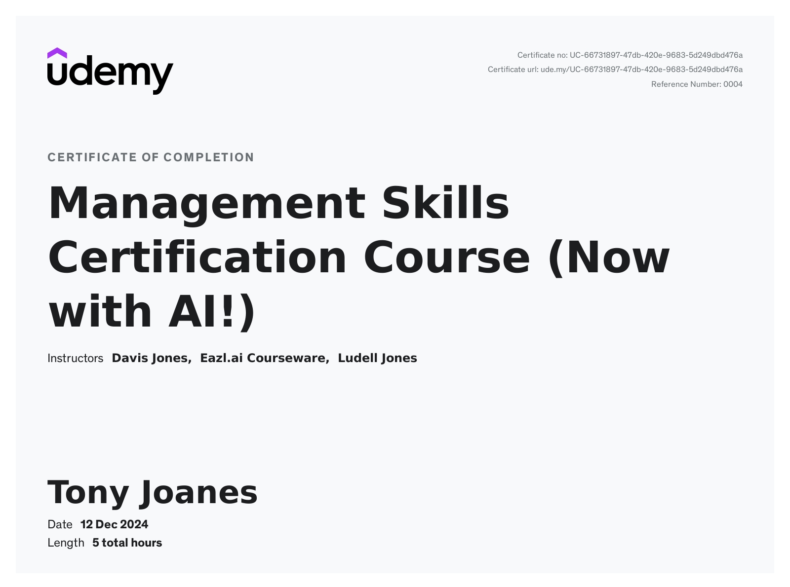
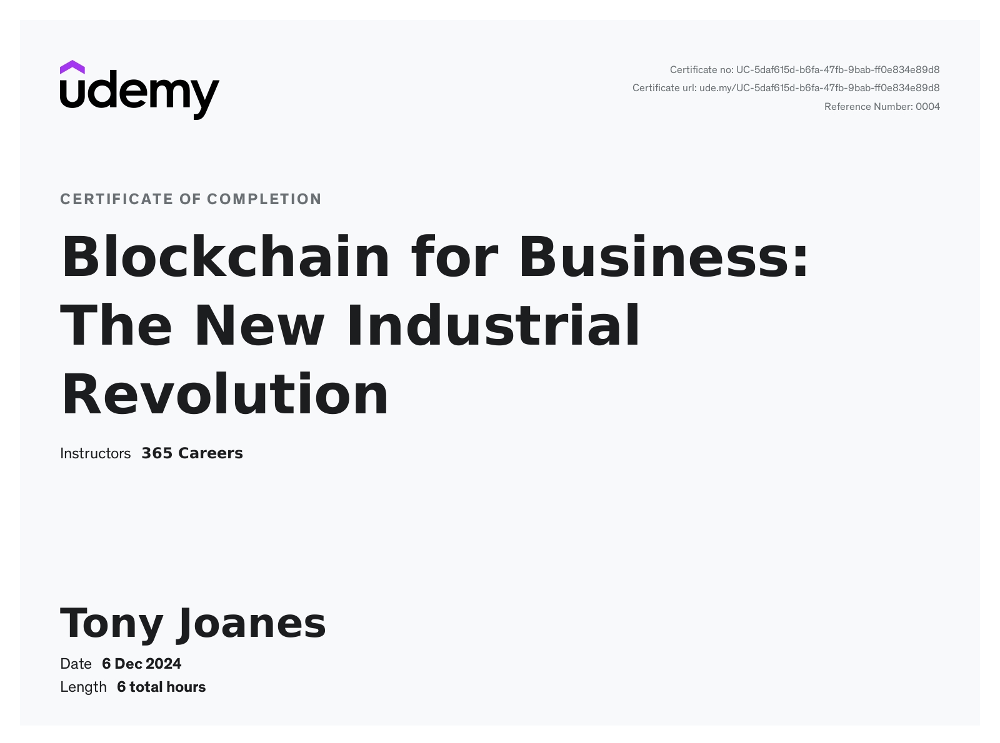
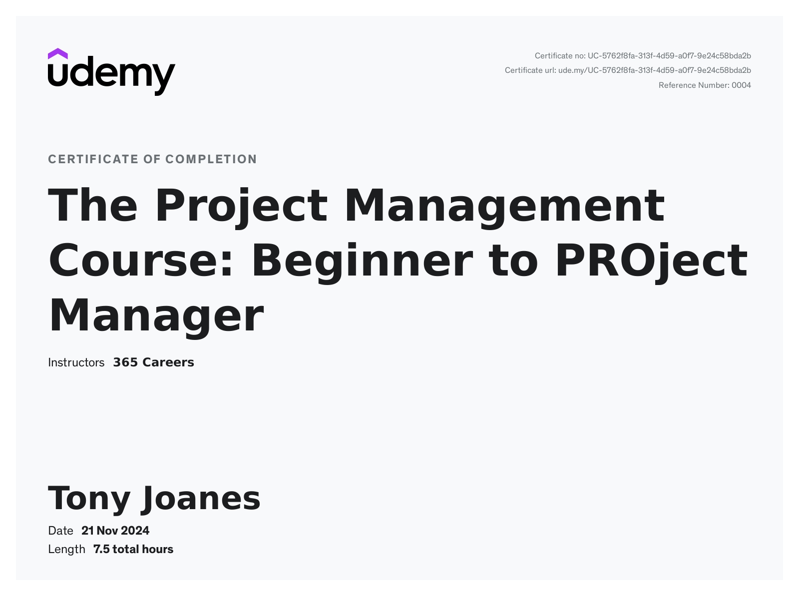
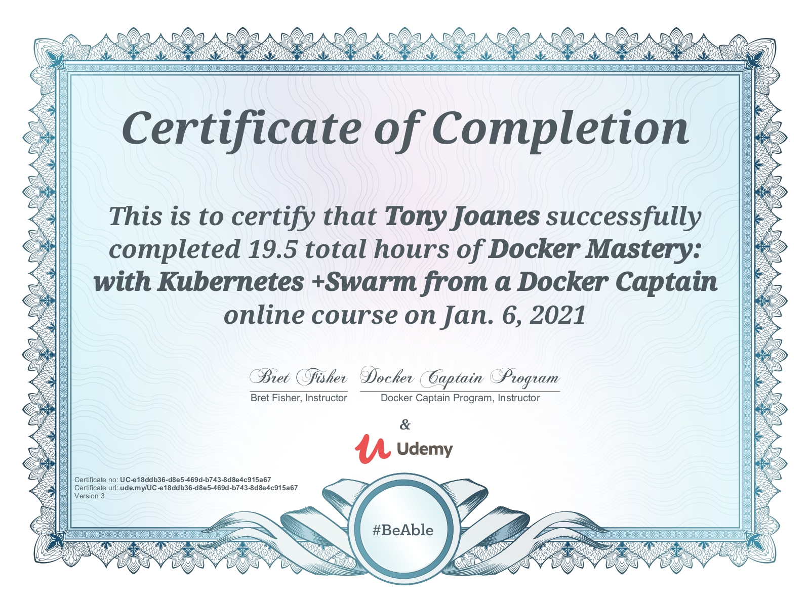
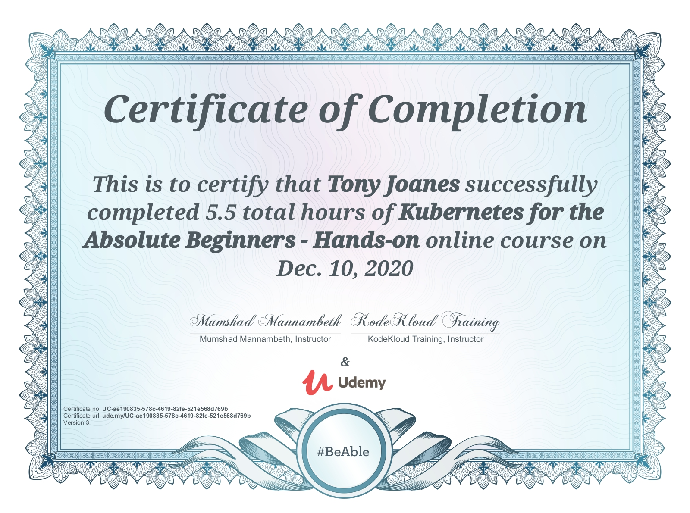
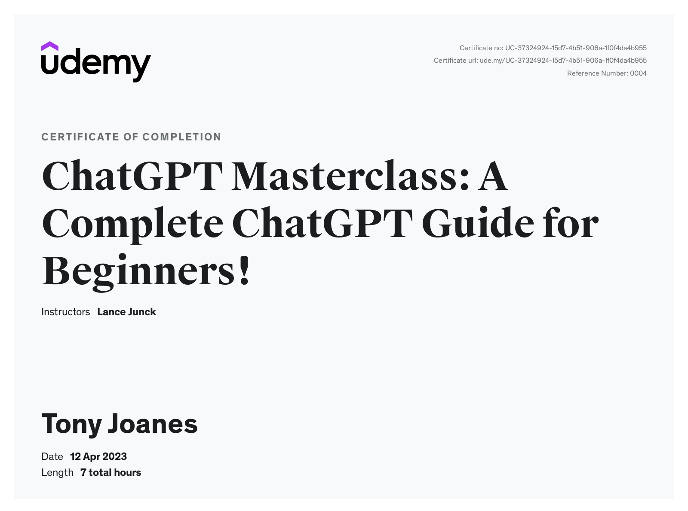
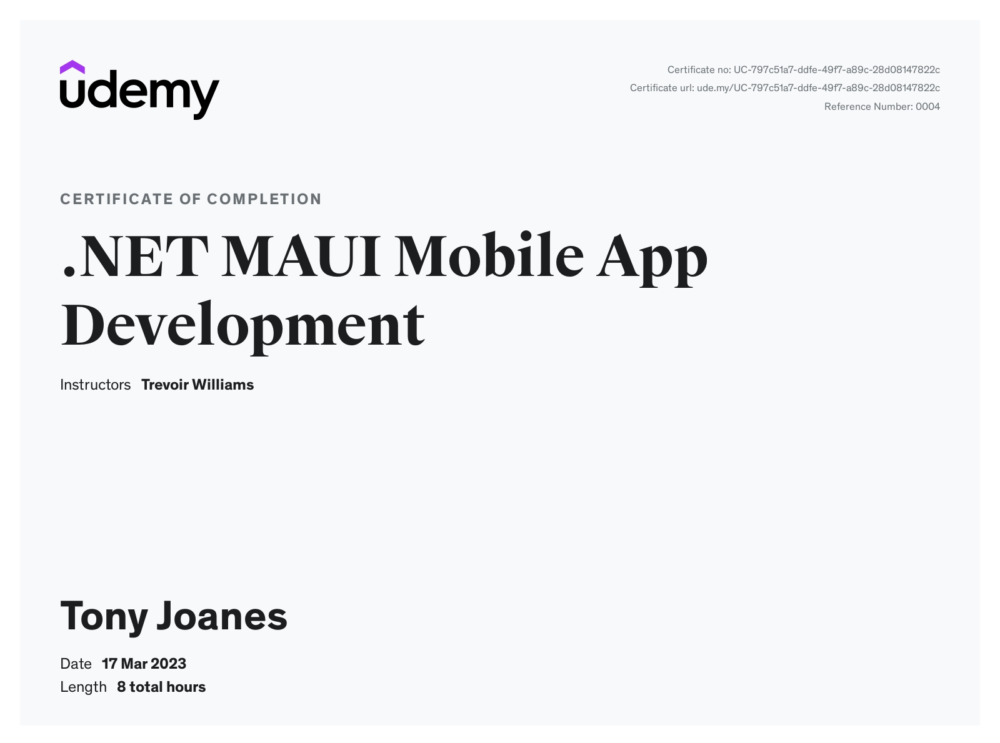
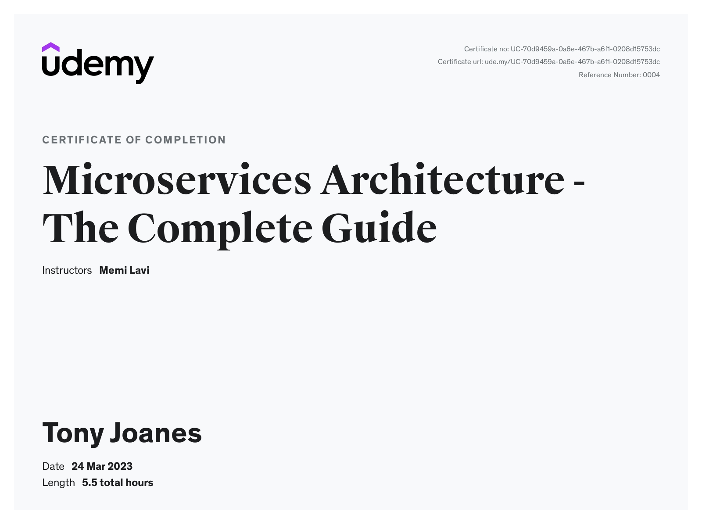

# Tony Joanes

[Substack](https://tonyjoanes.substack.com/)

## Summary
I am a software development expert with extensive experience in web and mobile application development, Kubernetes, and distributed architecture. My expertise includes various technologies and frameworks, such as C#, AngularJS, Cordova, TypeScript, ReactJS, Redux, ASP.NET MVC, and Cross Platform C# .Net Core Microservices. I have held various roles including Engineering Manager, Technical Lead, and Contract Software Engineer, which allowed me to work on diverse projects across multiple industries.

### Recent interests

I am taking a course in LLM Engineering and have a huge interest in AI. I belive the future is going to be huge for AI and BlockChain technology so in my spare time I study theses.

### Github Status (for fun)

 
   
  

### Experience
#### Engineering Manager/Technical Lead/Contract Software Engineer

- Led cross-functional development teams to deliver high-quality software applications using Agile methodologies.
- Managed the full software development lifecycle, from requirement gathering to deployment and maintenance.
- Worked on diverse projects across multiple industries, including finance, healthcare, and e-commerce.
- Demonstrated strong skills in team management, recruitment, and agile software development processes.
- Delivered software applications, ranging from mobile apps and web applications to large-scale enterprise systems built using Kubernetes and distributed architecture.
- Developed and maintained applications using C#, AngularJS, Cordova, TypeScript, ReactJS, Redux, and ASP.NET MVC.

### Skills
- Web and Mobile Application Development
- Kubernetes and Distributed Architecture
- AI and LLM engineering
- C#, Python, AngularJS, Cordova, TypeScript, ReactJS, Redux, ASP.NET MVC, and Cross Platform C# .Net Core Microservices
- Agile Software Development Processes
- Team Management and Recruitment
- Effective Communication and Collaboration with Clients and Stakeholders
- Software Engineering Best Practices

## Tech Stack

### Languages

### Tools

### Cloud

## Certificates

I believe in continuous learning and therefore am always studying technologies and skills.  

### Other

